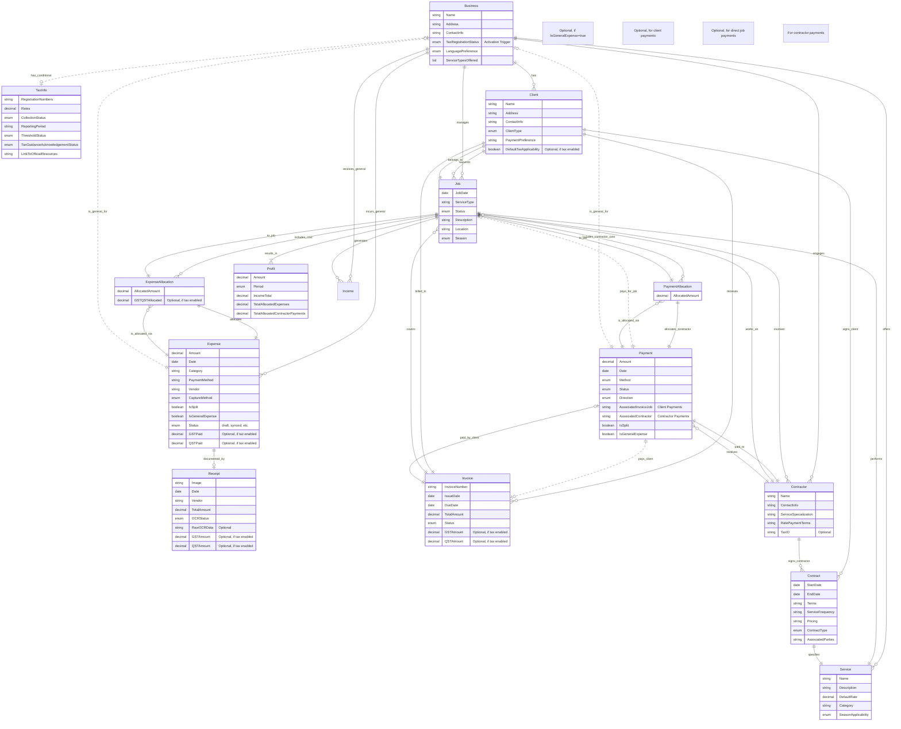

# Problem Domain Model - FinTrack

## Metadata
**Version:** 0.6 *(Updated Glossary for Standardized Terminology)*.
**Status:** Draft.
**Last Updated:** April 9, 2025.
**Owner:** FinTrack Project Manager.
**Reviewers:** [To be determined].

## Dependencies
**Required Artifacts:**
- Problem Statement Document *(Reflecting enhanced MVP & Core/Conditional)*
- User Needs Analysis *(v1.6 or later)*
- Interview Findings (P1, P2, P3, P4)

**Dependent Artifacts:**
- Scope Definition Document *(v0.4 or later)*
- Business Case Document
- Solution Vision Document

## **Guiding Principles**

1.  ***Core Experience Priority:*** The primary user experience focuses on effortless core features (jobs, expenses, profitability), remaining simple and functional independently of conditional modules.
2.  ***Integrated Conditional Design:*** While core workflow is primary, design core components anticipating logical integration points for optional conditional features (like taxes) to ensure smooth user transitions and efficient development.

## Purpose
This document establishes a clear, shared understanding of the FinTrack problem domain concepts, relationships, and business rules governing financial tracking for small service businesses (initially focusing on landscaping/lawn care) in Quebec, incorporating automated data capture and allocation concepts within the core workflow, and representing tax-related concepts as optional/conditional. It creates a common vocabulary for all project stakeholders and serves as the foundation for technical design decisions.

## Success Criteria
- [x] All key **core** domain concepts are identified and clearly defined.
- [x] **Conditional (tax)** concepts are identified and linked appropriately.
- [x] Relationships between domain concepts are mapped, emphasizing core relationships.
- [x] Business rules **(including automation for core tasks and conditional rules for taxes)** are documented with clear rationale.
- [x] Domain model is validated with subject matter experts.
- [x] Model is consistent with findings from user research **and enhanced scope with core/conditional separation**.
- [x] Model is comprehensive enough to support identified use cases **(including automated core workflows and conditional tax paths)**.

## Content Requirements
1. Domain Glossary
2. Conceptual Data Model
3. Business Rules Catalog
4. Domain Constraints
5. Domain Workflows/Processes

## Validation Methods
- [ ] Review with subject matter experts (service business owners).
- [x] Consistency check with user research findings and **enhanced MVP scope reflecting core/conditional split**.
- [ ] Walkthrough of model against primary use cases (**including automated core paths and conditional tax paths**).
- [x] Verification that all interview findings are addressed.
- [ ] Stakeholder review and sign-off.

## Content

### 1. Domain Glossary

| Term | Definition | Notes |
|------|------------|-------|
| Allocation | The process of distributing the cost of a single Expense or Contractor Payment across multiple Jobs. | Crucial **core** concept for accurate job costing of shared resources (e.g., fuel, bulk materials, contractor time). |
| Business Owner | An individual who owns and operates a small service business in Quebec. | May be a solo operator or manage employees and/or contractors. |
| Client | A person or business entity that contracts the service business to perform services. | May be one-time or recurring, have different payment methods. **Optional:** May require GST/QST on invoices if tax features enabled. |
| Contract | Formal agreement between business and client or business and contractor specifying services and payment terms. | May be per-visit, project-based, monthly, or seasonal for clients. Defines terms for contractors. **Core** concept for managing relationships. |
| Contractor | An individual or business engaged by the Business Owner to perform specific services, typically on a non-employee basis (independent contractor or subcontractor). | Distinct **core** entity to track involvement, payments, and potentially future interactions. Payments made require allocation to jobs. |
| **Deferred Processing** | **A workflow allowing a user to quickly capture initial expense information (e.g., a receipt image) and save it as a Draft Expense, postponing the detailed data entry, verification, and allocation steps for later completion.** | New definition added. |
| **Draft Expense** | **An expense record that has been initiated (e.g., by capturing a receipt image) but has not yet had all required information (verification, allocation, categorization) completed by the user. It is saved in a temporary state ('draft' status) for later completion.** | New definition added. |
| Expense | Money spent by the business for materials, equipment, fuel, subcontracting, or other operational costs. | May be associated with specific jobs (potentially split/allocated) or general overhead. **Input may be automated via core OCR.** Payments to Contractors result in expenses but are primarily tracked via the Contractor entity relationship. **Optional:** May include GST/QST details if tax features enabled. |
| GST/QST | Goods and Services Tax / Quebec Sales Tax that registered businesses must collect. | **Conditional:** Only relevant if business is registered and tax features are enabled. Thresholds apply. **Tax amounts on expenses may be auto-captured via OCR if enabled.** |
| Income | Money received from clients for services performed. | May be received via cash, e-transfer, check, or other methods. **Core** component of profitability. |
| Input Tax Credit (ITC) | GST/QST paid on business expenses that can be claimed back from tax authorities. | **Conditional:** Important for tax compliance and profitability calculations *if tax features are enabled*. **Identification potentially aided by OCR if enabled.** |
| Invoice | A formal document requesting payment for services rendered. | **Core** feature for requesting payment. **Optional:** May require GST/QST calculation if tax features enabled. |
| Job | A specific instance of service work performed for a client. | The fundamental unit for tracking **core** profitability; includes materials, labor, contractor costs, and other expenses. |
| OCR (Optical Character Recognition) | Technology used to automatically extract text data (vendor, date, amount; **optionally taxes**) from receipt images. | Key enabler for effortless **core** expense input. |
| Profit | Income minus **allocated** expenses (including **allocated** contractor payments), calculated at the job level or business level. | Key **core** metric for business success and decision-making. |
| Receipt | Document showing proof of purchase for an expense. | Critical for **core** expense tracking and job costing. **Can be captured via photo, potentially enabling automated data extraction (core OCR).** **Optional:** Used for tax deductions if tax features enabled. |
| Seasonal Business | Business operation that changes significantly between seasons. | Many businesses offer different services (e.g., landscaping vs. snow removal) with different models. Affects **core** operations. |
| Service | A type of work provided by the business (e.g., lawn mowing, gardening, snow removal, cleaning). | Businesses may offer multiple service types with different seasonal patterns and billing models. |
| Smart Suggestion | Context-aware recommendations provided by the app (e.g., suggesting which job an expense belongs to based on location/calendar). | Aims to reduce manual selection effort for **core** allocation tasks. |
| Tax Guidance | Information or links provided within the application regarding tax obligations (e.g., thresholds, common deductions). | **Conditional:** Intended to inform, not replace professional advice. May include user acknowledgements. Accessed only if relevant/enabled. |
| Tax Registration Status | A setting within the Business entity indicating whether the business is registered for GST/QST. | **This acts as the primary activation trigger for conditional tax features.** |
| Tax Threshold | Revenue level (currently $30,000 CAD) at which GST/QST registration becomes mandatory in Quebec. | **Conditional:** Important consideration for informal/growing businesses deciding whether to enable tax features. |

### 2. Conceptual Data Model

#### 2.1 Domain Entities

| Entity | Description | Key Attributes | Relationships |
|--------|-------------|----------------|--------------|
| Business | The service business itself. | Name, Address, Contact Info, **Tax Registration Status** (GST/QST - *Activation Trigger*), Language Preference (EN/FR), Service Types Offered | Has Clients, Services, Jobs, Expenses, Income, Contractors, **[Optional] Has TaxInfo (if registered)** |
| Client | Customer who receives services. | Name, Address, Contact Info, Client Type (One-time/Recurring), Payment Preference, **[Optional] Default Tax Applicability (if tax enabled)** | Has Jobs, Contracts (Client Contracts), Invoices |
| Job | Specific service instance performed for a client. | Job Date, Service Type, Status (Planned/In-Progress/Complete), Description, Location, Season (Summer/Winter/Other) | Belongs to Client, Has Service Type, Has Expense Allocations, Has Income, Involves Contractors |
| Service | Type of work offered. | Name, Description, Default Rate, Category, Season Applicability | Used in Jobs, Offered by Business |
| **Expense** | Money spent on business costs. | Amount, Date, Category, Payment Method, Vendor, CaptureMethod ('OCR', 'Manual'), IsSplit (Boolean), IsGeneralExpense (Boolean), **Status ('draft', 'synced', etc.)**, **[Optional] GST/QST Paid (if tax enabled)** | Has Expense Allocations (one or many), Has Receipt (optional) |
| **ExpenseAllocation** | Links an Expense to a Job and specifies the allocated amount. | AllocatedAmount, **[Optional] GSTQSTAllocated (if tax enabled)** | Belongs to Expense, Belongs to Job |
| **Receipt** | Proof of purchase document. | Image, Date, Vendor, Total Amount, OCRStatus ('Pending', 'Complete', 'Failed'), RawOCRData (optional), **[Optional] GST/QST Amount (from OCR, if tax enabled)** | Belongs to Expense |
| Invoice | Payment request document. | Invoice Number, Issue Date, Due Date, Total Amount, Status (Draft/Sent/Paid), **[Optional] GST/QST Amount (if tax enabled)** | Associated with Client, Contains Job(s) |
| **Payment** | Money received from client or paid to a Contractor. | Amount, Date, Method (Cash/E-transfer/Check), Status, Direction (In/Out), Associated Invoice/Job (Client Payments); Associated Contractor (Contractor Payments), IsSplit (Boolean), IsGeneralExpense (Boolean) | Has Payment Allocations (one or many, for Contractor Payments) |
| **PaymentAllocation** | Links a Contractor Payment to a Job and specifies the allocated amount. | AllocatedAmount | Belongs to Payment (Contractor), Belongs to Job |
| Contract | Service agreement. | Start Date, End Date, Terms, Service Frequency, Pricing, Contract Type (Per-Visit/Monthly/Seasonal/Project-Based), Associated Parties (Client or Contractor) | Associated with Client or Contractor, Contains Service(s) |
| **TaxInfo** | **(Conditional)** GST/QST-related information and guidance tracking. | Registration Numbers, Rates, Collection Status, Reporting Period, Threshold Status, Tax Guidance Acknowledgement Status, Link to Official Resources | **[Optional] Associated with Business (linked via Tax Registration Status)**, **[Conditional] Used by Invoices, Expenses** |
| **Contractor** | Individual or business performing services on a contract basis. | Name (Individual/Business), Contact Info, Service Specialization, Rate/Payment Terms, **[Optional] Tax ID (if applicable)** | Works on Jobs, Receives Payments, Has Contracts (Contractor Contracts) |
| Profit | Calculated financial performance. | Amount, Period (Job/Week/Month/Season), Income Total, Total Allocated Expenses, Total Allocated Contractor Payments | Associated with Job(s) or Business |

#### 2.2 Entity Relationship Diagram

### 3. Business Rules Catalog

| ID | Rule | Description | Rationale | Source |
|----|------|-------------|-----------|--------|
| BR-1 | Job Profit Calculation | **(Core)** Job profit equals total payments received minus sum of **allocated** expenses and **allocated** contractor payments associated with that job. | Core business need, requires accurate allocation. | Interview P1, P3, P4 |
| BR-2 | Tax Applicability | **(Conditional)** IF Business `Tax Registration Status` is 'Registered' OR annual revenue exceeds the current threshold, THEN GST/QST must be applied to invoices. | Quebec tax regulation compliance. Applies only if tax features are relevant/enabled. | Interview P1, P4 |
| BR-3 | Tax Input Credits | **(Conditional)** IF Business `Tax Registration Status` is 'Registered', THEN GST/QST paid on eligible business expenses can be claimed as input tax credits. **App aids identification via OCR/categorization if tax features enabled.** | Reduces tax burden and impacts profitability calculations for registered businesses. | Interview P1 |
| BR-4 | Offline Capability | **(Core)** Key **manual** transaction data (expenses, payments) must be recordable/viewable offline (with basic job selection) and synchronized later. **(Conditional)** Automated features (OCR, suggestions) may require connectivity. | Business often operates in areas with limited connectivity; manage expectations for advanced features. Core manual functions must work. | Interview P1, Feasibility Analysis |
| BR-5 | Flexible Service Types | **(Core)** Business may offer diverse service types with different operational models. | Reflects actual operation and growth plans. | Interview P1, P3, P4, User Feedback |
| BR-6 | Receipt Documentation | **(Core)** Expenses should allow for receipt image capture **with core OCR attempt** to substantiate costs and streamline input. **(Conditional)** Used for tax deductions if tax features enabled. | Prevents lost deductions (conditional), reduces manual entry (core). | Interview P1, P2, P3, User Feedback |
| BR-7 | Payment Method Tracking | **(Core)** System must track multiple payment methods for both incoming (Client) and outgoing (**Contractor**) payments. | Reflects actual payment methods. | Interview P1, P2, P3, P4 |
| BR-8 | Contract Type Flexibility | **(Core)** Different contract types must be supported with appropriate billing models for Client work. Terms for **Contractors** also need tracking. | Businesses use different contract models. | Interview P1, P3, P4 |
| BR-9 | Recurring vs. One-time Clients | **(Core)** System must distinguish between one-time and recurring clients. | Business treats these client types differently. | Interview P1 |
| BR-10 | Simplified Mode (Default) | **(Core)** System operates in a simplified mode by default, focusing on core profitability without mandatory complex tax tracking, unless conditional tax features are activated via `Tax Registration Status`. | Enables adoption by businesses at early stages or those not needing tax features. | Interview P2, P3 |
| BR-11 | Tax Threshold Awareness | **(Conditional)** IF conditional tax features are enabled, THEN system should monitor revenue relative to tax thresholds and provide informational alerts. | Addresses user confusion/anxiety and promotes responsible use *for those engaging with tax features*. | Interview P3, P4, User Feedback |
| BR-12 | Automated Data Capture (OCR) | **(Core)** System attempts OCR on receipt images for Vendor/Date/Amount; **user must confirm/correct extracted data before saving.** **(Conditional)** OCR also attempts GST/QST capture if tax features enabled. | Streamlines core input but requires user validation for accuracy. Conditional tax capture adds value if enabled. | Enhanced MVP Scope |
| BR-13 | Contextual Job Suggestions | **(Core)** System suggests job associations based on context (GPS, Calendar, Recency); **user confirms or manually selects/overrides.** | Speeds up core allocation but relies on user confirmation. | Enhanced MVP Scope |
| BR-14 | Cost Allocation & Validation | **(Core)** Expenses/Contractor Payments can be split across multiple jobs via an allocation mechanism. **Total allocated amount must equal the original item amount.** | Ensures accurate core costing for shared resources without creating/losing money. | Enhanced MVP Scope |
| BR-15 | Allocation Adjustment | **(Core)** Users must be able to easily modify or re-allocate previous expense/payment allocations to correct errors. | Provides flexibility and ensures core data accuracy over time. | Enhanced MVP Scope |
| BR-16 | General Expense Marking | **(Core)** Users must be able to easily mark expenses/payments as non-job specific (general overhead). | Ensures overhead is tracked but excluded from individual job profit calculations. | Enhanced MVP Scope |

### 4. Domain Constraints

| ID | Constraint | Description | Impact | Workarounds |
|----|------------|-------------|--------|------------|
| DC-1 | Mobile-First Access | **(Core)** Primary system interaction will occur on mobile devices in field conditions. | Limits UI complexity; requires intuitive design for core automation features. | Offer synced web access for complex tasks/review. |
| DC-2 | Variable Internet Connectivity | Users frequently work in areas with limited or no internet connectivity. | Requires robust **offline capability for core manual entry/capture**; **Advanced automation (OCR/suggestions) may be unavailable offline.** | Local storage with queued synchronization; clear UI indication of online/offline feature availability. |
| DC-3 | Limited Technical Skill | **(Core)** Users have minimal accounting knowledge and limited experience with financial software. | System must be extremely intuitive; core automation must be easy to understand and correct. **Conditional tax features must be clearly separated/explained.** | Progressive disclosure, guided workflows, simple correction mechanisms. Clear onboarding for conditional features. |
| DC-4 | Quebec Tax Requirements | **(Conditional)** IF enabled, system must handle Quebec's specific GST/QST rules accurately. **OCR must handle tax fields correctly if enabled.** | Increases complexity of conditional tax calculation/capture validation. | Separate tax module, clear guidance links, user responsibility acknowledgements, OCR validation/correction step for tax fields. |
| DC-5 | Seasonal Business Pattern | **(Core)** Business operations, income, and expense categories can change significantly between seasons. | Requires flexible categorization and reporting by season/service type. | Season/Service tagging for jobs, expenses with filtered views. |
| DC-6 | Limited Time for Administration | **(Core)** Users have minimal time for financial tracking due to focus on field work. | Data entry must be extremely efficient; **core automation is key.** | Quick-entry via OCR/suggestions, templates, default values. |
| DC-7 | Price Sensitivity | Target users have limited budget for business software ($10-20/month range confirmed). | Restricts development complexity and support options; **value of core automation must justify cost.** Conditional features might influence tiering/pricing. | Tiered feature approach with core automation in paid tiers. Evaluate pricing for conditional module. |
| DC-8 | Bilingual Requirements | **(Core)** System must support both English and French. | Increases UI/UX complexity and content management. | Standardized translation framework and language toggle. |
| DC-9 | Legal Classification | **(Core)** App terminology ("**Contractor**") does not dictate legal worker status; users are responsible for correct classification. | Potential user confusion or misreliance on app term. | Clear disclaimers; encourage professional legal advice. |
| DC-10 | OCR Accuracy Dependence | **(Core)** System usability heavily relies on acceptable OCR accuracy for core fields. **Errors require user correction.** **(Conditional)** Tax field OCR adds complexity if enabled. | **Low accuracy leads to frustration, negating time savings.** | **Easy correction UI; set realistic user expectations; choose reliable OCR tech.** Separate validation for tax fields. |
| DC-11 | Context Data Permissions | **(Core)** Smart suggestions rely on user granting permissions (GPS/Calendar). **Feature is less useful without permissions.** | **Appears less "smart" if permissions denied.** | **Clear value explanation; robust manual selection fallback.** |

### 5. Domain Workflows/Processes

#### 5.1 Process: Job Lifecycle Financial Management *(Core + Conditional Tax Steps)*
1. Step 1: Job Creation **(Core)**
   - Create new job record with client association
   - Specify service type and estimated pricing

2. Step 2: Job Expense Capture & Allocation **(Core + Conditional Tax Capture)**
   - **Capture expenses via OCR/manual entry (UC-ME)**
   - **Confirm/correct core OCR data (Vendor, Date, Amount)**
   - **(Conditional Step - If Tax Enabled):** Confirm/correct OCR tax data (GST/QST).
   - **Confirm/select/split job allocation using smart suggestions or manual choice (REQ-JP-05)**
   - Categorize expenses appropriately

3. Step 3: Job Completion & **Contractor** Payment Allocation **(Core)**
   - Mark job as complete
   - Record final service details and time spent (if tracked)
   - **Record contractor payments (UC-CP)**
   - **Confirm/select/split job allocation for payment using suggestions or manual choice (REQ-JP-07)**
   - Calculate actual cost (**sum of allocated expenses & payments**)

4. Step 4: Invoicing (Client) **(Core + Conditional Tax Calculation)**
   - Generate invoice based on services performed
   - Apply appropriate pricing
   - **(Conditional Step - If Tax Enabled):** Calculate and add GST/QST based on registration status.
   - Send invoice to client

5. Step 5: Payment Collection (Client) **(Core)**
   - Record payment received against Invoice or Job
   - Document payment method
   - Update invoice status

6. Step 6: Profitability Analysis & Adjustment **(Core)**
   - Calculate job profit (payment received - allocated expenses - allocated contractor payments)
   - Review job profitability details
   - **Adjust allocations if necessary (REQ-JP-11)**
   - Add job to weekly/monthly profit reporting

#### 5.2 Process: Tax Management for Quebec Businesses *(Conditional Workflow)*
*(This entire process applies only IF conditional tax features are enabled via the "Tax Registration Status" setting)*
1. Step 1: Tax Status Tracking
   - Monitor revenue relative to GST/QST thresholds
   - Alert user when approaching registration thresholds (BR-11)
   - Record user acknowledgement of tax responsibility
   - Update tax status when business registers (via profile setting)

2. Step 2: GST/QST Collection
   - Apply correct tax rates to invoices based on business status
   - Track collected taxes separately from service revenue

3. Step 3: Input Tax Credit Tracking
   - Record GST/QST paid on eligible business expenses (**potentially auto-captured via OCR**)
   - User confirms/corrects captured tax amounts
   - Categorize expenses for appropriate ITC claims
   - Maintain receipt documentation (digital image) to support claims

4. Step 4: Periodic Tax Reporting
   - Generate summary reports for GST/QST collected
   - Calculate ITCs for the period (based on confirmed expense data)
   - Determine net tax payable/refundable
   - Export data for filing with Revenu Québec

5. Step 5: Tax Payment/Refund Tracking
   - Record tax payments/refunds
   - Reconcile with period calculations
   - Close tax period when complete

#### 5.3 Process: Seasonal Transition Management **(Core)**
1. Step 1: End-of-Season Review
2. Step 2: Service Offering Adjustment
3. Step 3: Contract Conversion
4. Step 4: Equipment/Supply Expense Management
5. Step 5: Seasonal/Service Cash Flow Planning

#### 5.4 Process: Informal-to-Formal Business Transition *(Core with Conditional Activation)*
1. Step 1: Basic Tracking (Informal Mode - Core Default)
   - Record cash income and basic expenses (**using simplified core automated capture - UC-ME**)
   - Track weekly profit/loss
   - Maintain simple client list & job records
   - Optionally track **Contractor** involvement & payments (**via core UC-CP**)

2. Step 2: Enhanced Financial Visibility (Core)
   - Begin tracking per-job profitability more formally (**core data capture easier via automation**)
   - Categorize expenses more precisely (**core - aided by OCR/suggestions**)

3. Step 3: Decision to Formalize & Activate Tax Features
   - Explore tax rules and obligations (GST/QST thresholds via Tax Guidance - UC-TG)
   - Register business when appropriate
   - **Activate conditional tax features within the app by changing "Tax Registration Status" in profile.**

4. Step 4: Formal Operations (Core + Enabled Conditional)
   - Implement formal invoicing (UC-IG now includes tax calculations).
   - Track tax on expenses systematically (UC-ME now includes tax capture).
   - Implement contracts for recurring services and/or **Contractors** (future feature).

5. Step 5: Tax Compliance (Conditional)
   - Track tax obligations systematically using enabled features (**leveraging captured data**)
   - Prepare for first tax filing period using generated reports (UC-TR)
   - Generate reports for accountant review

## Assumptions
- [x] Business owners have basic smartphone proficiency for **core tasks**.
- [x] Most expenses can be categorized into common groups (fuel, materials, equipment, etc.) for **core tracking**.
- [x] Users prioritize **simplicity, speed, and effortless input for core tasks** over comprehensive accounting features.
- [x] Both formal and informal business operation models exist in the market, requiring a flexible approach (**core default + optional conditional**).
- [x] Seasonal transitions or offering diverse services are common **core operational patterns**.
- [x] Basic tax knowledge varies significantly among users; guidance is helpful **if/when they engage with conditional tax features**.

## Risks
- [x] Risk 1: **Complex conditional tax calculations/OCR capture may lead to compliance issues if not accurate and easily correctable when enabled.**
   - Impact: Legal and financial repercussions for users who activate these features.
   - Mitigation: Consult with Quebec tax experts; clear disclaimer; user validation/correction step for OCR tax data; rigorous testing of conditional module.
- [x] Risk 2: Diverse business models may challenge the unified domain model.
   - Impact: Model may not fit all user cases perfectly.
   - Mitigation: Design core for flexibility with optional components; tiered approach.
- [x] Risk 3: Scope creep due to adjacent service industries or advanced features beyond enhanced MVP (both core and conditional).
   - Impact: Loss of focus on core MVP needs or delayed conditional module.
   - Mitigation: Strict scope management against enhanced MVP definition (Core first).
- [x] Risk 4: **Offline functionality technical challenges, especially differentiating core manual vs. online automation.**
   - Impact: Unreliable data, synchronization issues, user confusion.
   - Mitigation: Robust offline-first architecture *for core manual*; clear UI indicators for online features; thorough testing.
- [x] Risk 5: User confusion regarding legal status of "**Contractors**" despite app terminology (**core issue**).
   - Impact: Misreliance on app, potential legal issues for users.
   - Mitigation: Clear in-app disclaimers, help documentation, encourage professional advice.
- [x] Risk 6: **Core OCR Accuracy may not meet expectations.**
    - Impact: Frustration, manual correction negates benefit.
    - Mitigation: Set realistic targets, use reliable tech, provide easy correction UI.
- [x] Risk 7: **Core Smart suggestions may be inaccurate or unhelpful.**
    - Impact: User ignores feature or makes incorrect allocations.
    - Mitigation: Algorithm tuning, allow easy manual override/selection, gather user feedback.

## Review Notes
- [ ] Review 1
   - Reviewer: [Name]
   - Date: [Date]
   - Comments: [Comments]
   - Status: [Status]

## Change Log
| Date             | Version | Changed By   | Changes Made |
| :--------------- | :------ | :----------- | :------------------------------------------------------------------------------------------------------------------------------------------------------------------------------------------------------------------------------------------- |
| April 7, 2025    | 0.1     | FinTrack PM  | Initial creation based on interview findings |
| April 7, 2025    | 0.2     | FinTrack PM  | Incorporated user feedback: Added core Expense categories; Confirmed Helper as distinct entity; Added Tax Guidance concept & rule (BR-11); Emphasized Service flexibility; Confirmed Assumptions & Workflows. |
| April 8, 2025    | 0.3     | FinTrack PM  | Standardized terminology: Replaced "Helper" with "Contractor" throughout. Added Domain Constraint DC-9 and Risk 5 related to legal classification disclaimer. Adjusted related descriptions. |
| April 8, 2025    | 0.4     | Gemini Model | **Major Revision:** Updated Glossary, Entities (Expense, Payment, added Allocation), Relationships, Business Rules (added BR-12 to BR-16), Constraints (added DC-10, DC-11), and Workflows to incorporate automation features (OCR, Suggestions, Splitting, Adjustment) aligning with enhanced MVP Scope (v1.4/v0.4). |
| April 9, 2025    | 0.5     | Gemini Model | **Refactored based on core vs. conditional prioritization instructions:** Added Guiding Principles; Marked tax-related entities/attributes/rules as optional/conditional; Emphasized core concepts in Glossary, Model, Rules, Constraints, Workflows; Referenced activation trigger (`Tax Registration Status`). Ensured full document output. |
| **April 9, 2025** | **0.6** | **Gemini Model** | **Updated Glossary:** Added definitions for "Draft Expense" and "Deferred Processing" based on user feedback and standardized terminology. Updated Expense entity attributes to include Status. Updated ERD diagram. Updated version number. |

## Sign-off
- [ ] Technical Review
- [ ] Business Review
- [ ] Stakeholder Review
- [ ] Final Approval

## Next Steps
- Complete Scope Definition Document (v0.4) using this updated domain model (Done)
- Refine Business Case with insights from domain analysis
- Begin Solution Vision development
- Schedule review with service business owners to validate model updates **(including core/conditional separation and automation concepts)**
- Evaluate technical approach for **core OCR, suggestions, offline limitations, and conditional module integration**.
- Use this updated model (v0.6) as the basis for subsequent documentation and design decisions.