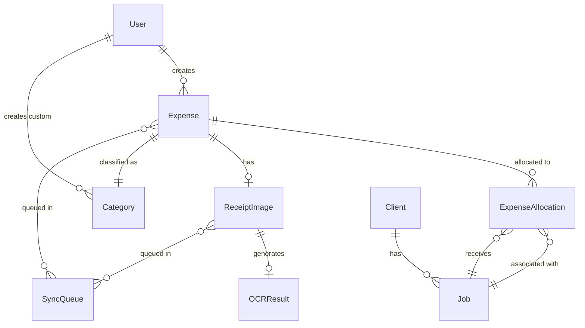

# Mobile Expense Tracking - Data Model

This document outlines the key data structures and relationships required to support the Mobile Expense Tracking (UC-ME) use case.

## Core Entities

### Expense

The primary entity representing a financial transaction captured by a user.

```json
{
  "id": "string (UUID)",
  "user_id": "string (reference to User)",
  "date": "date (YYYY-MM-DD)",
  "vendor": "string",
  "total_amount": "decimal",
  "category_id": "string (reference to Category)",
  "description": "string (optional)",
  "receipt_image_id": "string (reference to ReceiptImage)",
  "status": "enum (draft, pending_sync, synced, error)",
  "created_at": "datetime",
  "updated_at": "datetime",
  "created_offline": "boolean",
  "tax_details": {
    "tax_included": "boolean",
    "tax_amounts": [
      {
        "tax_type": "string (e.g., GST, QST)",
        "amount": "decimal",
        "rate": "decimal",
        "confidence_score": "decimal (0-1)"
      }
    ]
  },
  "metadata": {
    "location": {
      "latitude": "decimal",
      "longitude": "decimal",
      "accuracy": "decimal (meters)"
    },
    "device_info": "string",
    "ocr_confidence_score": "decimal (0-1)"
  }
}
```

### ExpenseAllocation

Represents how an expense is allocated across multiple jobs.

```json
{
  "id": "string (UUID)",
  "expense_id": "string (reference to Expense)",
  "job_id": "string (reference to Job)",
  "amount": "decimal",
  "percentage": "decimal (0-100)",
  "notes": "string (optional)",
  "created_at": "datetime",
  "updated_at": "datetime"
}
```

### ReceiptImage

Stores information about a captured receipt image.

```json
{
  "id": "string (UUID)",
  "expense_id": "string (reference to Expense)",
  "file_path": "string (local path or cloud URI)",
  "file_size": "integer (bytes)",
  "mime_type": "string",
  "width": "integer (pixels)",
  "height": "integer (pixels)",
  "processing_status": "enum (pending, processing, completed, failed)",
  "ocr_result_id": "string (reference to OCRResult)",
  "created_at": "datetime",
  "updated_at": "datetime",
  "sync_status": "enum (local_only, syncing, synced)",
  "retention_expires_at": "datetime (optional)"
}
```

### OCRResult

Stores the extracted data and metadata from OCR processing.

```json
{
  "id": "string (UUID)",
  "receipt_image_id": "string (reference to ReceiptImage)",
  "vendor": {
    "text": "string",
    "confidence_score": "decimal (0-1)",
    "bounding_box": {
      "x": "integer",
      "y": "integer",
      "width": "integer",
      "height": "integer"
    }
  },
  "date": {
    "text": "string",
    "parsed_date": "date (YYYY-MM-DD)",
    "confidence_score": "decimal (0-1)",
    "bounding_box": {
      "x": "integer",
      "y": "integer",
      "width": "integer",
      "height": "integer"
    }
  },
  "total_amount": {
    "text": "string",
    "amount": "decimal",
    "confidence_score": "decimal (0-1)",
    "bounding_box": {
      "x": "integer",
      "y": "integer",
      "width": "integer",
      "height": "integer"
    }
  },
  "tax_amounts": [
    {
      "tax_type": "string",
      "text": "string",
      "amount": "decimal",
      "confidence_score": "decimal (0-1)",
      "bounding_box": {
        "x": "integer",
        "y": "integer",
        "width": "integer",
        "height": "integer"
      }
    }
  ],
  "raw_text": "string",
  "processing_time_ms": "integer",
  "created_at": "datetime",
  "provider": "string (e.g., 'google_vision', 'ml_kit', 'tesseract')"
}
```

### Category

Represents expense categories for classification.

```json
{
  "id": "string (UUID)",
  "name": "string",
  "icon": "string",
  "color": "string (hex color)",
  "default_tax_deductible": "boolean",
  "is_system": "boolean",
  "user_id": "string (optional, for custom categories)",
  "created_at": "datetime",
  "updated_at": "datetime"
}
```

### Job

Contains job information for expense allocation.

```json
{
  "id": "string (UUID)",
  "name": "string",
  "client_id": "string (reference to Client)",
  "status": "enum (active, completed, on_hold, canceled)",
  "description": "string",
  "start_date": "date",
  "end_date": "date (optional)",
  "location": {
    "address": "string",
    "latitude": "decimal",
    "longitude": "decimal"
  },
  "created_at": "datetime",
  "updated_at": "datetime",
  "budget": {
    "total": "decimal",
    "materials": "decimal",
    "labor": "decimal",
    "other": "decimal"
  }
}
```

### SyncQueue

Manages the synchronization of local data with cloud storage.

```json
{
  "id": "string (UUID)",
  "entity_id": "string",
  "entity_type": "string (e.g., 'expense', 'receipt_image')",
  "action": "enum (create, update, delete)",
  "status": "enum (pending, in_progress, completed, failed)",
  "priority": "integer",
  "retry_count": "integer",
  "next_retry_at": "datetime (optional)",
  "error": "string (optional)",
  "created_at": "datetime",
  "updated_at": "datetime"
}
```

## Entity Relationships



## Data Flow

### Expense Creation Flow

1. User captures receipt -> Creates `ReceiptImage`
2. OCR processes image -> Creates `OCRResult`
3. User verifies/edits data -> Creates `Expense`
4. User associates with job(s) -> Creates `ExpenseAllocation`(s)
5. Data is saved locally -> Updates `Expense.status = 'pending_sync'`
6. Sync service queues data -> Creates `SyncQueue` entries
7. Data synchronizes to cloud -> Updates `Expense.status = 'synced'`

### Offline Handling

1. Detect offline mode
2. Store `ReceiptImage` locally
3. Allow manual data entry for `Expense`
4. Queue for sync with high priority
5. Process OCR when connectivity returns

## Data Validation Rules

### Expense
- `total_amount` must be positive
- `date` cannot be in the future
- Sum of all `ExpenseAllocation.amount` must equal `Expense.total_amount`

### ExpenseAllocation
- Sum of all percentages for the same expense must equal 100%

### ReceiptImage
- Image file size limit: 10MB
- Supported formats: JPEG, PNG, HEIF

### Tax Details
- Tax amounts must be non-negative
- Tax rates must match configured rates for the tax type

## Data Storage Strategy

### Local Storage (Mobile)
- SQLite database for structured data
- File system for images with encryption
- Data prioritization for sync:
  1. Expense metadata
  2. ExpenseAllocation data
  3. Receipt images (when on Wi-Fi)

### Cloud Storage
- Relational database for structured data
- Object storage (S3, GCS) for receipt images
- Caching strategy for frequently accessed data

## Search & Retrieval Patterns

### Local Search
- Full-text search on vendor and description
- Filter by date range, category, job, and amount range
- Sort by date (recent first) and amount

### Cloud Search
- Advanced search with additional filters
- Aggregate reporting across expenses

## Data Retention & Privacy

- Receipt images optional deletion after sync
- Configurable retention period (default: 7 years)
- Data encryption both in transit and at rest
- All PII handled according to privacy policy

## Version Control & Migration

- Schema versioning for backward compatibility
- Data migration strategy for app updates
- Graceful handling of schema differences during sync