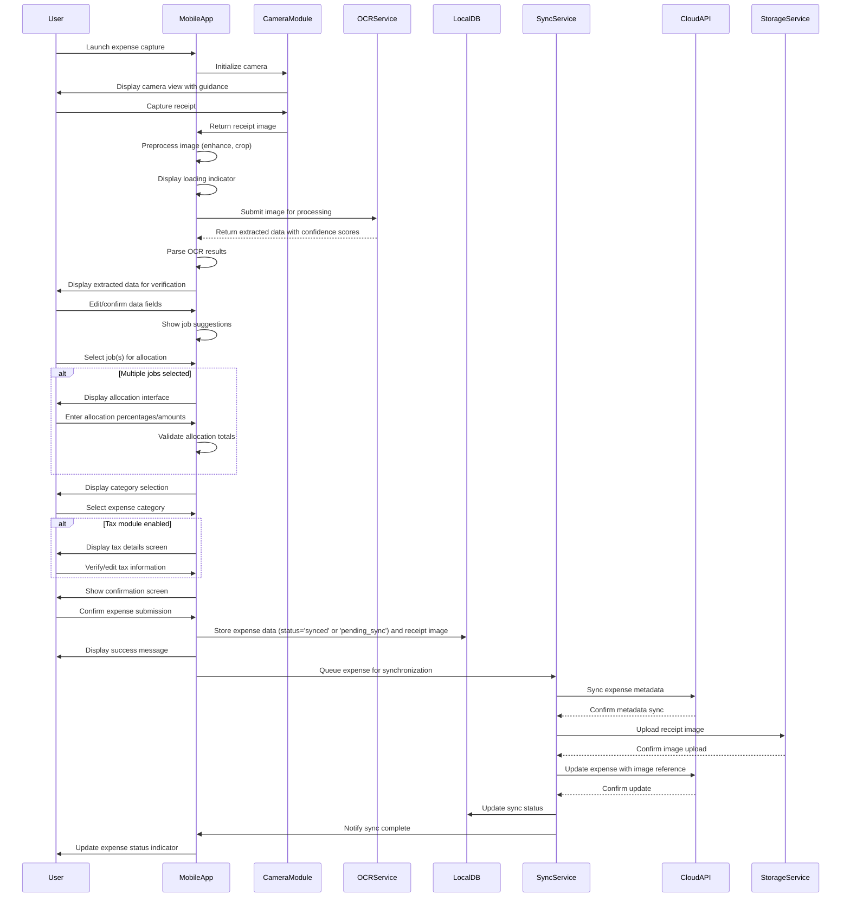
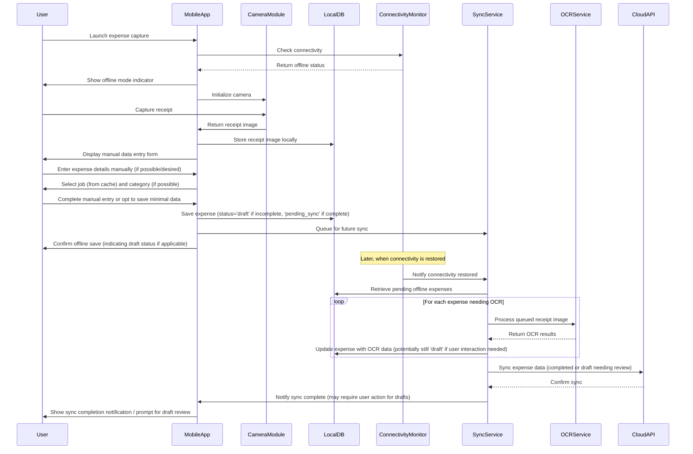
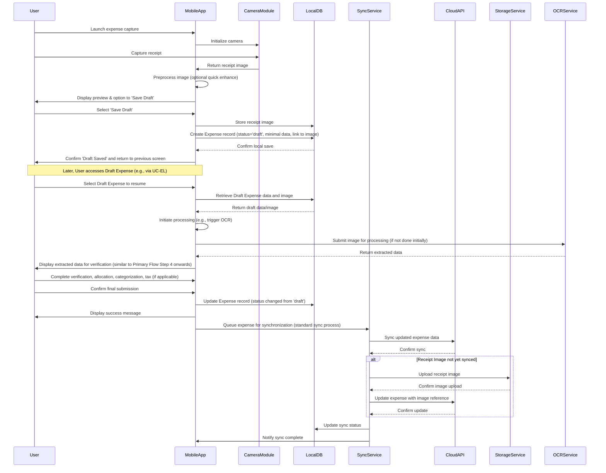
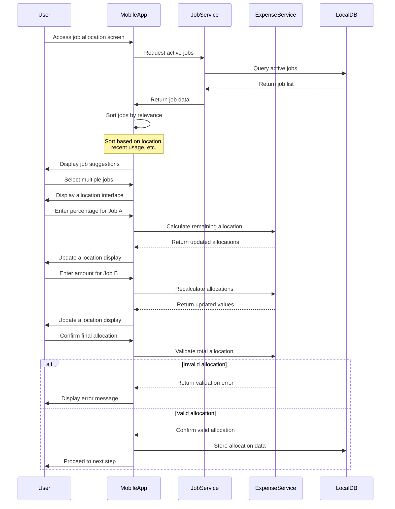
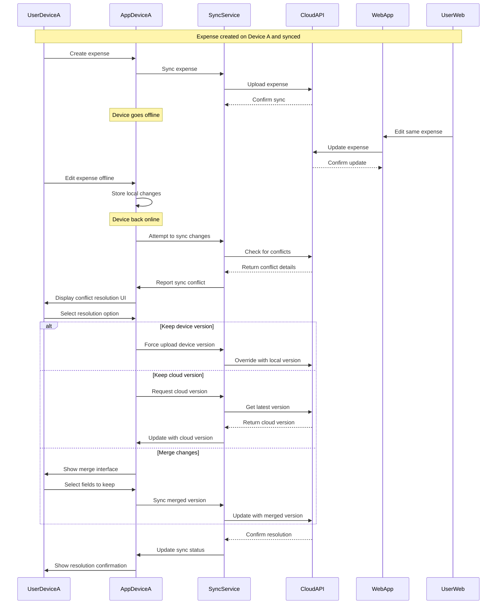

# Mobile Expense Tracking - Sequence Diagram

This document illustrates the sequence of interactions between system components for the core mobile expense tracking workflows.

## Primary Flow: Online Receipt Capture & Processing

## Alternative Flow: Offline Receipt Capture

## New Flow: Deferred Processing (Online)

## Expense Allocation Flow

## Conflict Resolution Flow

## System Component Overview

The sequence diagrams above reference the following key system components:

1.  **MobileApp**: The user-facing mobile application interface
2.  **CameraModule**: Handles camera access and image capture functionality
3.  **OCRService**: Performs optical character recognition on receipt images
4.  **LocalDB**: Local database for offline storage and caching (including Draft Expenses)
5.  **SyncService**: Manages data synchronization between local and cloud storage
6.  **CloudAPI**: Server-side API for data persistence and processing
7.  **StorageService**: Cloud storage service for receipt images
8.  **ConnectivityMonitor**: Monitors network connectivity status
9.  **JobService**: Manages job data and related operations
10. **ExpenseService**: Handles expense-related business logic and operations

These components work together to provide a seamless expense tracking experience for the user, with robust offline capabilities, data synchronization, and support for **Deferred Processing** of expenses.